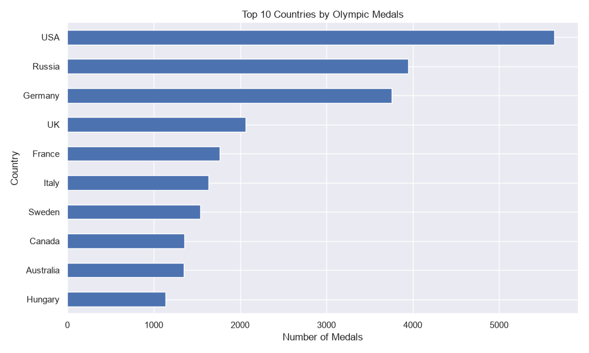
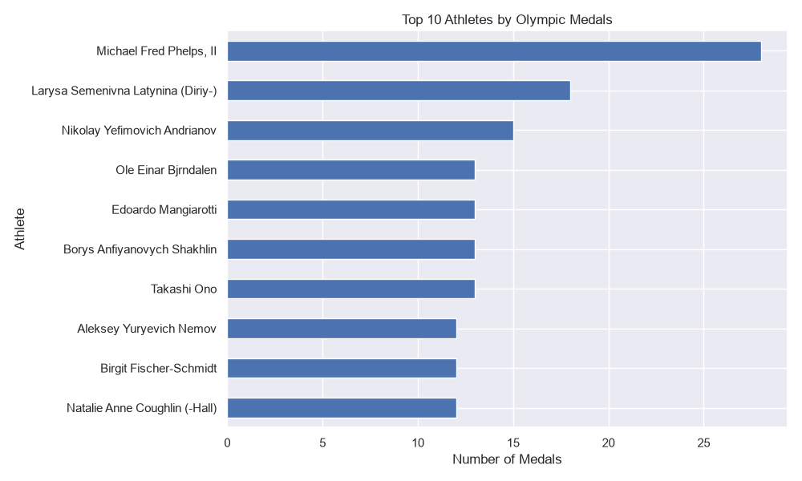
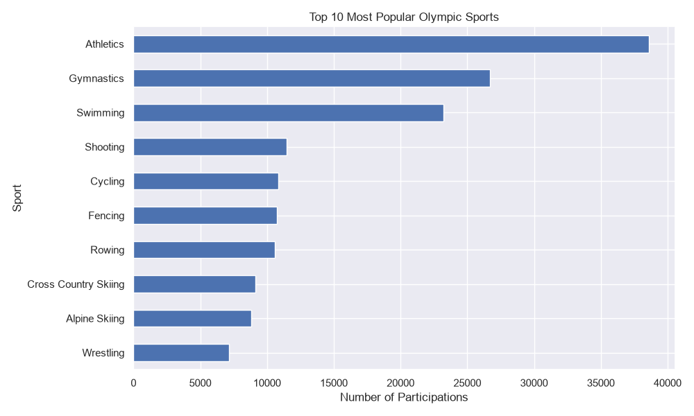
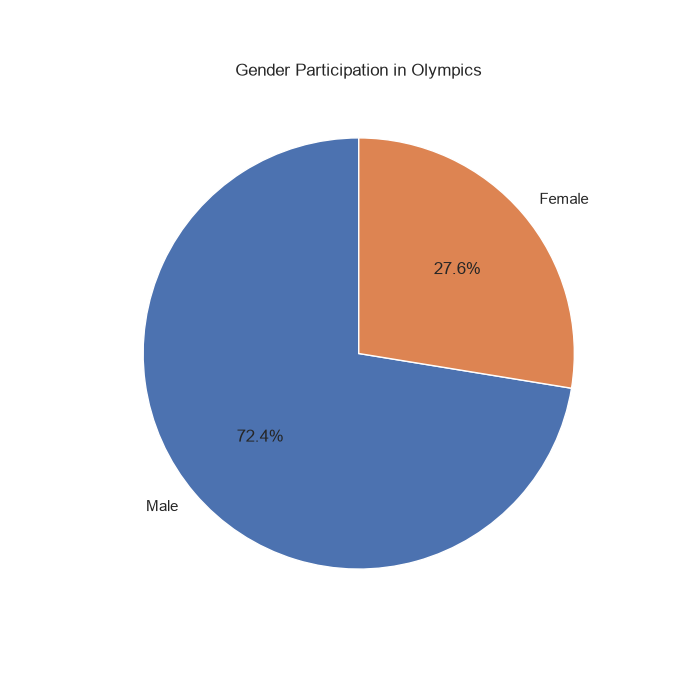
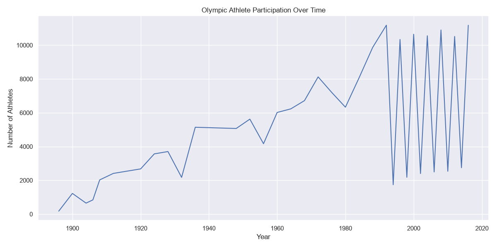
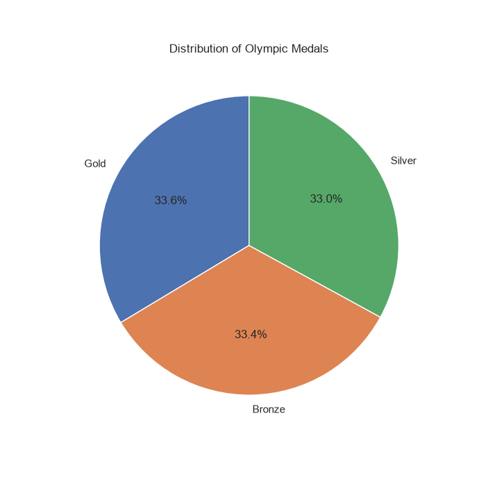
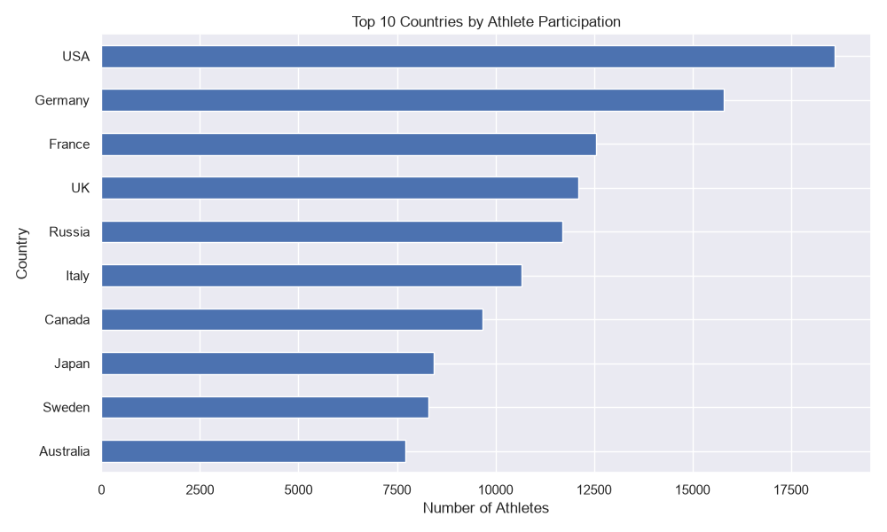
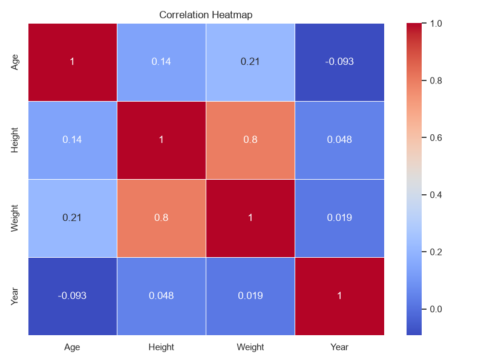

# 🥇 Olympic Data Analysis


## 📌 Project Overview

This project explores **120 years of Olympic history** using **Python** and **Exploratory Data Analysis (EDA)**.

The analysis uncovers patterns in medal distribution, athlete performance, sports popularity, gender participation, and Olympic participation trends through informative visualizations.

---

## 🎯 Objectives

- 🥇 Analyze medals won by different countries
- 🏃 Identify the most successful Olympic athletes
- 🏀 Explore the popularity of Olympic sports
- 👨‍🦰👩‍🦰 Compare male and female participation
- 📈 Study Olympic participation over time
- 📊 Visualize key trends using Python

---

## 🛠️ Technologies Used

- Python
- Pandas
- Matplotlib
- Seaborn
- Jupyter Notebook

---

## 📂 Dataset

Dataset used:

**120 Years of Olympic History: Athletes and Results**

Files:

- athlete_events.csv
- noc_regions.csv

---

# 📊 Analysis & Visualizations

## 🥇 Top 10 Countries by Olympic Medals



**Insights**

- USA leads the overall Olympic medal tally.
- European countries dominate the top rankings.
- Medal distribution highlights historical sporting strength.

---

## 🏅 Top 10 Athletes by Olympic Medals



**Insights**

- A small number of athletes have achieved extraordinary Olympic success.
- Consistent performance across multiple Olympic Games contributes to high medal counts.

---

## 🏀 Top 10 Most Popular Olympic Sports



**Insights**

- Athletics has the highest athlete participation.
- Swimming and Gymnastics are also among the most popular sports.

---

## 👩 Gender Participation



**Insights**

- Male participation has historically been higher.
- Female participation has steadily increased over the years.

---

## 📈 Olympic Participation Over Time



**Insights**

- Olympic participation has grown significantly over time.
- Temporary declines correspond to major historical events such as World Wars.

---

## 🏅 Medal Distribution



**Insights**

- Gold, Silver, and Bronze medals are distributed almost equally.
- The visualization reflects the Olympic medal awarding system.

---

## 🌍 Top Participating Countries



**Insights**

- The United States consistently sends one of the largest Olympic teams.
- Larger delegations often have greater medal opportunities.

---

## 🔥 Correlation Heatmap



**Insights**

- Height and weight show a positive correlation.
- Age has only a weak relationship with other numerical features.

---

# 📁 Project Structure

```
Olympic-Data-Analysis/
│
├── data/
│   ├── athlete_events.csv
│   └── noc_regions.csv
│
├── notebooks/
│   └── olympic_analysis.ipynb
│
├── images/
│   ├── correlation_heatmap.png
│   ├── gender_participation.png
│   ├── medal_distribution.png
│   ├── participation_trend.png
│   ├── top_10_athletes.png
│   ├── top_10_countries_medals.png
│   ├── top_10_sports.png
│   └── top_participating_countries.png
│
├── README.md
├── requirements.txt
└── .gitignore
```

---

# 🚀 How to Run

Clone the repository:

```bash
git clone https://github.com/muthumalar2301-lily/Olympic-Data-Analysis.git
```

Navigate to the project:

```bash
cd Olympic-Data-Analysis
```

Install the required libraries:

```bash
pip install -r requirements.txt
```

Launch Jupyter Notebook:

```bash
jupyter notebook
```

Open:

```
notebooks/olympic_analysis.ipynb
```

Run all cells.

---

# 📌 Key Findings

- 🥇 USA has won the highest number of Olympic medals.
- 🏃 A few athletes dominate the all-time medal rankings.
- 🏀 Athletics and Swimming are among the most popular sports.
- 👩 Female participation has increased significantly over time.
- 📈 Olympic participation has steadily grown throughout history.
- 📊 Height and weight are positively correlated.

---

# 👩‍💻 Author

**Muthu Malar**

📧 GitHub: https://github.com/muthumalar2301-lily

---

⭐ **If you found this project interesting, consider giving it a star!**
